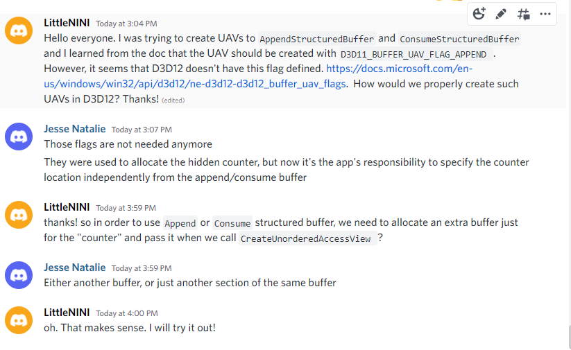

# TODO

It's not straightforward to use Consume/Append structured buffer in D3d12. 

Also, see DirectX Graphics Sample, 

https://github.com/microsoft/DirectX-Graphics-Samples/tree/master/Samples/Desktop/D3D12ExecuteIndirect for an example of using `AppendStructuredBuffer`

Also, be aware of padding and alignment when setting the counter byte offset! 