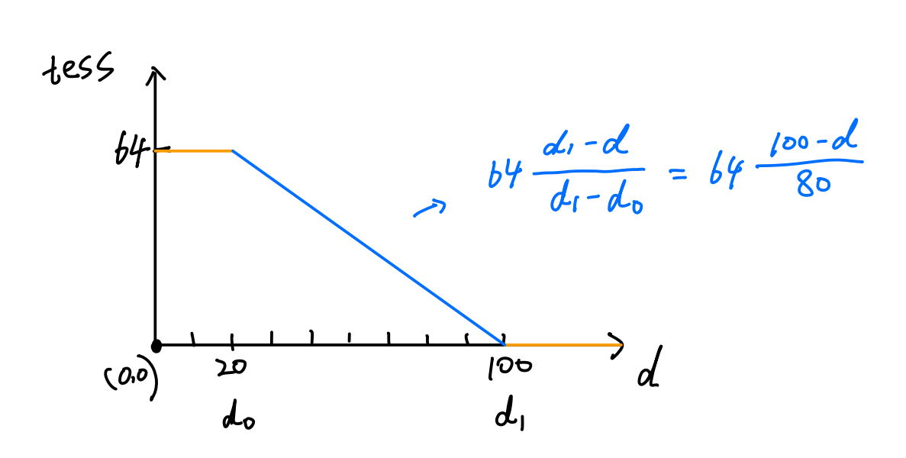

# Basic Tessellation

This demo submits a quad patch to the rendering pipeline, tessellates it based on the distance from the camera, and displaces the generated vertices by a mathematical function.

## Images 

### Quad Patch

### Tessellation-Distance Function

