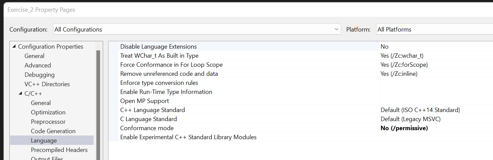

# DirectX 12 Graphics Playground

This repo servers as my DirectX 12 playground to try new ideas and rendering techniques. The initial framework comes from the book *Introduction to 3D Game Programming with DirectX 12 by Frank Luna*. This project also contains lots of modifications to the original framework and my solutions to most of the written and coding exercises in the book. 


# Demos

| Name                                                         | Screenshot                                                   | Description                                                  |
| ------------------------------------------------------------ | ------------------------------------------------------------ | ------------------------------------------------------------ |
| Sky Rendering                                                |                                                              |                                                              |
| Picking                                                      |                                                              |                                                              |
| SSAO                                                         |                                                              |                                                              |
| [Shadow Mapping](https://github.com/zixin96/d3d12book/blob/master/Chapter%2020%20Shadow%20Mapping/Shadows) |  | This demo shows a basic implementation of the shadow mapping algorithm. |


## Points of Interest

We hardcode values and define things in the source code that might normally be data-driven. 

---

Non-standard Microsoft C++ extension errors

> Taking an address of class r-value is non-standard Microsoft C++ extension

Reason: 

```c++
ThrowIfFailed(md3dDevice->CreateCommittedResource(
        &CD3DX12_HEAP_PROPERTIES(D3D12_HEAP_TYPE_DEFAULT), // HERE!
        D3D12_HEAP_FLAG_NONE,
        &depthStencilDesc,          
        D3D12_RESOURCE_STATE_COMMON, 
        &optClear,                   
        IID_PPV_ARGS(&mDepthStencilBuffer)));
```

Fix 1:



Fix 2: 

```c++
CD3DX12_HEAP_PROPERTIES defaultHeap = CD3DX12_HEAP_PROPERTIES(D3D12_HEAP_TYPE_DEFAULT);
ThrowIfFailed(md3dDevice->CreateCommittedResource(
        &defaultHeap, // & operator requires L-value
        D3D12_HEAP_FLAG_NONE,
        &depthStencilDesc,          
        D3D12_RESOURCE_STATE_COMMON, 
        &optClear,                   
        IID_PPV_ARGS(&mDepthStencilBuffer)));
```

---

Output float values to debug window: 

```c++
std::wostringstream woss;
woss << mLightRotationAngle;
OutputDebugString(woss.str().c_str());
OutputDebugString(L"\n");
```

---

Major shift starting from Chapter 7: from synchronizing the CPU and GPU once per frame, to using a circular array of the resources the CPU needs to modify each frame (frame resources).

```c++
void App::Update(const GameTimer& gt)
{
	// Update things that are not in frame resources...

	// Get the next available frame resource
	mCurrFrameResourceIndex = (mCurrFrameResourceIndex + 1) % gNumFrameResources;
	mCurrFrameResource      = mFrameResources[mCurrFrameResourceIndex].get();
	
    // Is this frame resource being used by GPU? 
	if (mCurrFrameResource->Fence != 0 && mFence->GetCompletedValue() < mCurrFrameResource->Fence)
	{
        // This frame resource is in use by GPU
		HANDLE eventHandle = CreateEventEx(nullptr, false, false, EVENT_ALL_ACCESS);
		ThrowIfFailed(mFence->SetEventOnCompletion(mCurrFrameResource->Fence, eventHandle));
		WaitForSingleObject(eventHandle, INFINITE);
		CloseHandle(eventHandle);
	}
	
    // This frame resource is not in use by GPU
    // Update things that are in frame resources...
}
```

"This frame resource is not in use by GPU" means two things: 

1. The frame resource is in its initial state (`mCurrFrameResource->Fence == 0`). There is no data in it. We can safely upload data. **OR** 
2. Directx12 Fence has reached the frame resource's fence value (`mFence->GetCompletedValue() >= mCurrFrameResource->Fence`). GPU has finished using this frame resource's data. We can safely update the data.

---

What things need to be in the frame resource? 

- Things we update every frame on the CPU's side **AND**
- GPU will access them every frame 

---

Imgui: 

Subapplicaitons only need to add imgui code in Draw functions

See `LandAndWaves` project for more details

```c++
void XXApp::Draw(const GameTimer& gt)
{
	//--------imgui---------------
	// Start the Dear ImGui frame
	ImGui_ImplDX12_NewFrame();
	ImGui_ImplWin32_NewFrame();
	ImGui::NewFrame();
	//--------imgui---------------

...

	//--------imgui---------------
	ImGui::Render();
	mCommandList->SetDescriptorHeaps(1, mSrvHeap.GetAddressOf());
	ImGui_ImplDX12_RenderDrawData(ImGui::GetDrawData(), mCommandList.Get());
	//--------imgui---------------

	...

	//--------imgui---------------
	//! Note: this line is only necessary if we enable multi viewport, which we have by default
	ImGui::UpdatePlatformWindows();
	ImGui::RenderPlatformWindowsDefault(NULL, (void*)mCommandList.Get());
	//--------imgui---------------

	...
}
```

---

Every `x` seconds, we do something: 

```c++
void XXApp::UpdateXX(const GameTimer& gt)
{
	// Every x second, do something
	static float t_base = 0.0f;
	if ((mTimer.TotalTime() - t_base) >= x)
	{
		t_base += x;

		// do something
	}

	...
}
```

---

Changed to using the latest texture loading code from DirectXTex: https://github.com/microsoft/DirectXTex/tree/main/DDSTextureLoader

---

In HLSL, `operator*` is **component-wise!**

```c++
gout[i].PosH  = mul(float4(v[i].PosW, 1.f), gWorld * gViewProj);
```

`gWorld * gViewProj` is done component-wise!. **If `gWorld` is an identity matrix, it will corrupt your `gViewProj`**!

 **In GLSL, `operator*` between matrices is the standard linear algebra matrix multiplication whereas in HLSL it is the component-wise multiplication.** 

HLSL: 

>All of the operators that do something to the value, such as + and *, work per component. 

https://docs.microsoft.com/en-us/windows/win32/direct3dhlsl/dx-graphics-hlsl-operators#additive-and-multiplicative-operators

GLSL:

> For matrices, these operators also work component-wise, **except** for the `*`-operator, which represents a matrix-matrix product, e.g.:

https://en.wikibooks.org/wiki/GLSL_Programming/Vector_and_Matrix_Operations

---


## Credits

https://www.3dgep.com/category/graphics-programming/directx/

[Introduction to 3D Game Programming with DirectX 12](https://www.amazon.com/Introduction-3D-Game-Programming-DirectX/dp/1942270062)

[DirectXTex repo](https://github.com/microsoft/DirectXTex)


